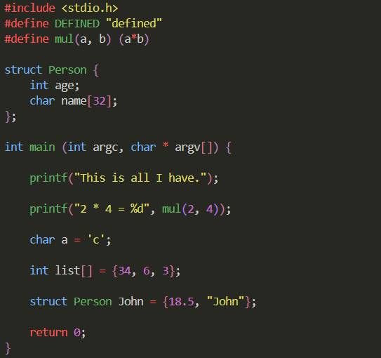

##### Below shown is purely implemented in C23 via a self-coded framework called _Verlet Lexer_ _(Vlex)_. Not the best practices were followed, and many changes in the future are to come, but even this primitive lexer could colorize the tokens of a C code.

# Verlet Lexer
Verlet Lexer is a C framework that enables token recognition. It is commonly referred to as _Vlex_ and is a component of a unification called the _Verlet Framework_.

A lexer is any implementation that breaks down text data into fragmented data, into fragments called _tokens_. Verlet Lexer does the same but in a highly modifiable manner, being a C framework, it integrates with C to provide system level control along with token recognition which allows the making-of compilers, _transpilers_, interpreters, anything that relies on token recognition.

