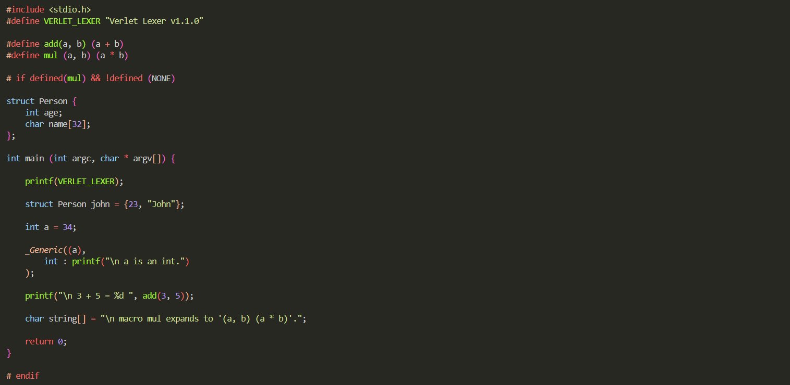

<!--  -->

# Status

Reacent release : [v1.3.0](https://github.com/why-parth/verlet-lexer/releases/tag/v1.3.0)

 

 
##### Above shown colored token highlighting is implemented purely in C23 via a self-coded framework called _Verlet Lexer_.

 

# Verlet Lexer
Verlet Lexer is a C framework that enables token recognition. It is commonly referred to as _Vlex_ and is a component of a unification called the _Verlet Framework_.

A lexer is any implementation that breaks down text data into fragmented data, into fragments called _tokens_. Verlet Lexer does the same but in a highly modifiable manner, being a C framework, it integrates with C to provide system level control along with token recognition which allows the making-of compilers, _transpilers_, interpreters, anything that relies on token recognition.

# VScript
#### _version 1.3.0_

_**VScript**_ is the DSL (Domain Specific Language) of Verlet Lexer that works remarkably well with C.

About VScript in [DSL.md](DSL.md).

 

##### Many documentations are to come in future
