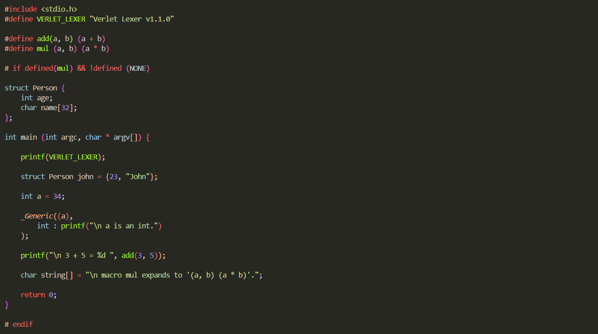
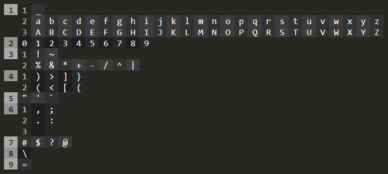

<!--  -->


# Status

Reacent release : v1.1.0

<br>

 
##### Above shown colored token highlighting is implemented purely in C23 via a self-coded framework called _Verlet Lexer_.

<br>


# <span style="color:rgb(224, 102, 102)">Verlet Lexer</span>
Verlet Lexer is a C framework that enables token recognition. It is commonly referred to as _Vlex_ and is a component of a unification called the _Verlet Framework_.

A lexer is any implementation that breaks down text data into fragmented data, into fragments called _tokens_. Verlet Lexer does the same but in a highly modifiable manner, being a C framework, it integrates with C to provide system level control along with token recognition which allows the making-of compilers, _transpilers_, interpreters, anything that relies on token recognition.


### Components of Verlet Lexer
- Data Structures
    - `avsme`
    - `hash`
    - VLUT _(Variation Look-Up Table)_
- Collect Functions
    - `collect_immediate`
    - `collect_variation`
- Domain Specific Language _( **Vscript** )_
    - **VLUT** Maker
    - **EM** _(Expected Mode)_ Maker
    - **FIO** _(File Input/Output)_ Manager
    - __*UC*__ _(Universal Context)_ Maker **<span style="font-size:80%;color:red"> ------------------------------- ! Not Yet Added ! </span>**

>_Universal Context Maker_ is Verlet's approach as parsing tokens. It is a complex header with its own DSL that can be (is always) seen as a part of Verlet Lexer's DSL Vscript. UCM is a token parsing utility; Conventianally being the suceeding step to lexical analysis, token parsing in Verlet Lexer is a part of Vscript (that is a lexer's DSL).

<br>

# <span style="color:rgb(224, 102, 102)">Data Structures of Verlet Lexer</span>

## `avsme`
AVSME _( `avsme` )_ stands for ASCII-Variance-Subclass-Mainclass-Exists, it is a _memory_ layout that is defined to store the _identity_ of a `char`, _identity_ unifies all the essential information about a `char` that we can ever require in the later stages of lexical analysis.

`avsme` is defined in the SVH _(Standard Verlet Header)_ `svh_01_avsme.h`, AVSME Header. AVSME Header implements a 16 bit long layout using the `uint_least16_t`, the memory layout reserves (from the left):
- 8 bits for the ascii value of the char
- 1 bit for the variance of the char (for later stage processing)
- 2 bits for sub-class
- 4 bits for main-class
- 1 bit for marking validity

`ascii` `variance` `sub-class` `main-class` `exists`

### AVSME Interface
AVSME Interface refers to the collection of utilities defined in the AVSME Header.

`AVSME_GET(a)`, returns the value of the query (`ASCII`, `VARIANCE`, `SUBCLASS`, `MAINCLASS` or `EXISTS`).

`AVSME_SET(a)`, assigns the value of the query.

`AVSME_VARIANT(a)`, returns `AVSME_GET(a, VARINACE)`.

`AVSME_BOOLEAN(a)`, returns the boolean value (`AVSME_TRUE`, `AVSME_FALSE` or `AVSME_NONE`).


`AVSME_COMPARE(a, b)`, returns `1` if the value of the query is same for both `a` and `b`, `0` if not.

`AVSME_OVERLAP(a, b)`, returns `1` if the ASCII value of `a` and `b` is same or if the class of `a` _includes_ that of `b`, `0` otherwise.

> The phrase _"class of `a` includes that of `b`"_ will be made clear once char classes are understood. 


### Char Class
Characters in this framework can be grouped into classifications called _char classes_ such as `numeric` _(numbers)_, `operate` _(operators)_. Sometimes, classes are not enough to correctly group the characters, in those cases, _char sub-classes_ can also be defined.

Char classes can be _(must be)_ defined using the macro `charclass`, `charclass` is a keyword in Verlet Lexer framework, it is not allowed to name anything as `charclass`.

To not have any char class, you can define `charclass` as,

```C
#define charclass(c) AVSME_SET(1, ASCII, c)
```

Verlet Lexer comes with a standard implementation of char classes.

<table>
<tr>
	<td>Main Class</td>
	<td>Sub Class</td>
	<td>Instances</td>
</tr>
<tr>
    <td rowspan="3"><code>idvalid</code></td>
    <td><code>under</code></td>
    <td><code>_</code></td>
</tr>
<tr>
    <td><code>lower</code></td>
    <td><code>a</code>-<code>z</code></td>
</tr>
<tr>
    <td><code>upper</code></td>
    <td><code>A</code>-<code>Z</code></td>
</tr>
<tr>
    <td colspan="2"><code>numeric</code></td>
    <td><code>0</code>-<code>9</code></td>
</tr>
<tr>
    <td rowspan="2"><code>operate</code></td>
    <td><code>oneval</code></td>
    <td><code>~</code> <code>!</code></td>
</tr>
<tr>
    <td><code>twoval</code></td>
    <td><code>+</code> <code>-</code> <code>*</code> <code>/</code> <code>%</code> <code>^</code> <code>&amp;</code> <code>|</code></td>
</tr>
<tr>
    <td rowspan="2"><code>enclose</code></td>
    <td><code>close</code></td>
    <td><code>&gt;</code> <code>)</code> <code>]</code> <code>}</code></td>
</tr>
<tr>
    <td><code>open</code></td>
    <td><code>&lt;</code> <code>(</code> <code>[</code> <code>{</code></td>
</tr>
<tr>
    <td colspan="2"><code>quoting</code></td>
    <td><code>`</code> <code>"</code> <code>'</code></td>
</tr>
<tr>
    <td rowspan="3"><code>disjoin</code></td>
    <td><code>comma</code></td>
    <td><code>,</code> <code>;</code></td>
</tr>
<tr>
    <td><code>dot</code></td>
    <td><code>.</code> <code>:</code></td>
</tr>
<tr>
    <td><code>space</code></td>
    <td><code> </code></td>
</tr>
<tr>
    <td colspan="2"><code>special</code></td>
    <td><code>#</code> <code>$</code> <code>@</code> <code>?</code></td>
</tr>
<tr>
    <td colspan="2"><code>escape</code></td>
    <td><code>\</code></td>
</tr>
<tr>
    <td colspan="2"><code>assign</code></td>
    <td><code>=</code></td>
</tr>
</table>

This implementation not only has _classes_, but they also have _sub\_classes_. To use this implementation, we must define `charclass` as a macro as,

```C
#define charclass VERLET_charclass
```

>If you use the above implementation alone, the escape sequences give an _invalid char_ error, and that error can be handles using the `VSCRIPT_INVALID_CHAR_CASE` macro. When you include the standard implementation via `verlet_std.h`, the escape sequences already come implemented using `VSCRIPT_INVALID_CHAR_CASE` so no need to do anything.

`VERLET_charclass_print` is a function that prints the Verlet's standard implementation of the `charclass`, it does work for other implementations but only if the guidelines are followed.

> Verlet's standard `charclass` implementation printed using `VERLET_charclass_print`
>
> 
>
> You can see how each mainclass is represented with a number, and so is the sub-class. Those numbers are the internally assigend enumarations; Those classes that do not have any sub-classes have the _sub-class enumeration_ of `0`.
>
> Mainclass and Subclass can be represented using just _one two digit number_. Ones digit representing the subclass, Tens digit representing tha mainclass. For example `42` represents, `4` for mainclass that is char mainclass `enclose`, and `2` for subclass that is char subclass `close`.

Collectively, mainclass and subclass are called fullclass, that can be represented using just one two digit number. Fullclass for Verlet's standard charclass can be attained using the function `VELRET_fullclass`.

Char-class inclusion is a bool that is evaluated as, for `a` and `b`,
- Mainclass of `b` must always be as that of mainclass of `a`.
- If `a` has sub-class, subclass of `b` must always be as that of subclass of `a`.
- If `a` doesn't have sub-class, subclass of `b` can be anything.

> Char-class inclusion is also called char-class overlap. `AVSME_OVERLAP(a, b)` returns the overlap of `a` and `b`, sequence matters.

## `hash`
Hash _( `hash` )_ is simply `typedef uint64_t`, it is defined to store _unique_ integers. _Hash functions_ are those functions that take in a seed a generate a unique number as an output. There can be collisions, but the chances of two seeds restulting in the same seed can be reduced to practically null using the right hash functions.

The hash function used in Verlet Lexer is _FNV_ _(Fowler–Noll–Vo)_ hash function _(64 bit variant, more about it on [wikipedia](https://en.wikipedia.org/wiki/Fowler%E2%80%93Noll%E2%80%93Vo_hash_function))_

It is define

`hash` is defined in the SVH `svh_02_hash.h`, Hash Header.

### FNV Keywords
FNV keywords automate the process of creating FNV hashes, there are a total of four FNV Keywords.

`svh_02_hash.h`, has `hash __token_meta` defined globally so that any part of the program can write to it.

<br>

`push_fnv` is used to append `__token_meta` by any possible number.
```C
fnv_push 45;
fnv_push 't';
/*
__token_meta now stores an integer that
belongs only to the sequence {45, 't'}.
*/
``` 

<br>

`get_fnv` is simply defined as `(__token_meta)`, it is used to retrieve the value of `__token_meta`
```C
printf("%zu\n", get_fnv);
printf("%zu\n", __token_meta);
// same output.
``` 

<br>

`get_reset` resets the value of `(__token_meta)`.
```C
fnv_push 45;
fnv_push 't';
printf("%zu\n", get_fnv);
fnv_reset;
// __token_meta stores nothing now.
``` 

Always reset FNV.

<br>

`fnv(string, ...)` is macro defined to perform two tasks,

- It can return the fnv of string (same character sequence will result in the same FNV),
`hash unique_int = fnv("this");`,
`unique_int` now stores an integer that belongs only to the sequence {`'t'`, `'h'`, `'i'`, `'s'`}.
Same result could be achieved by doing,
`fnv_reset;`
`fnv_push 't'; fnv_push 'h'; fnv_push 'i'; fnv_push 's'; hash unique_int = get_fnv;`
`fnv_reset;`

<br>

- If you pass two arguments to the `fnv` macro, it ends up assiging the first argument, the hash of the second argument _(must be a string)_.
`fnv(unique_int, "this");`, is same as `unique_int = fnv("this");`. 
However if `unique_int` _(passed variable name)_ is not defined, you must complete the syntax by adding `hash` before,
`hash fnv(unique_int, "this");`.

<br>

`cast_to_fnv(value)` is macro defined to perform a very important task,
- If value is if type `char *` (string), calculate the FNV for value and return it.
- Else, type cast value into `hash` and return it.

<br>

> `fnv()` and `cast_to_fnv()` do not affect `__token_meta`.

<br>

# <span style="color:rgb(224, 102, 102)">Mechanisms of Verlet Lexer</span>


## Verlet Lexer as a State Machine
Verlet Lexer is a _state machine_, which means that what is does is pre-defined but how it does is user-defined (about it on [wikipedia](https://en.wikipedia.org/wiki/Finite-state_machine)).

A user can define multiple set of rules _(states)_ and set those any of them as active _(active state)_, at any point in the program's entire run-time.

Earlier we saw how `charclass` must be defined in the begining of the program, in reality `charclass` too is a state, we can define `charclass` as,

```C
#define charclass STATE_charclass
avsme (* STATE_charclass)(char c);
// Now we can dynamically set different charclass implementations as active.
```

> Usually, we never change `charclass` after definition, so we use a function instead of a function pointer. But, `charclass` can absolutely be changed at any point in the midst of the program run-time, it is legal to do that.

## Token Collection

In Verlet Lexer, extracting tokens from a string is referred to as _collecting_ tokens. And all token collection in Verlet Lexer is done by following a simple algorithm.

The algorithm,

```C

char * string;
char select = string[0];
char target;
size_t len = sizeof(string);

putchar(select);

for (int i = 1; i < len; i++) {
    target = string[i];

    if ( condition ) putchar('\n');

    select = string[i];
    putchar(select);
}
```
  
This algorithm performs a very simple task, and that is, _print the characters normally but if `condition` is true, then print `\n` before the char_. As a result, _characters are grouped_ on the basis of when `condition` is true and when it is not.

This fairly simple algorithm groups characters on the basis of what makes `condition` true. The more formal name of this condition is `variation` _(Variation)_. And the entire algorithm can be looked at as,
- Define variation.
- Take a string.
- Iterate through the string and split the string wherever _variation_ is true.

Now, variation can be a function of _index (of the string)_, _select_, _target_, or anything at all. 

>Verlet Lexer does not explitcly define `variation`, neither does it explicitly uses the _algorithm's template_, this algorithm exists merely in spirit, the concept of this alorithm is practiced in the overall process of token collection.
>
>The standard process of token collection in Verlet Lexer assumes `variation` as a function of _select_ and _target_.


<br>

# <span style="color:rgb(224, 102, 102)">Collect Functions</span>
Collect functions are functions that take in a string and output the first token of that string. There are two types of collect functions that are defined by the SVHs,
- `collect_immediate`
- `collect_variation`

<br>

## `collect_immediate` 

### Theory
`collect_immediate` returns the first token of the passed string, on the basis of a condition.

```C
int collect_immediate(char * string, ) {
    char select = string[0];
    char target;
    int i = 1;

    for (; target = string[i]; i++) 

        if (charclass(select) != charclass(target))
        break;
        else
        select = target;

    return i;
}
```

In this implementation, we get the index of the char where the new token starts relative to the passed string.

Given that we have set Velet Lexer's standard `charclass` as active,
```C
#define charclass VERLET_charclass
```

We can start to detect the tokens right away,
```C
char code[] = "int a = 45;";

char * token = code;
int token_end;

token_end = collect_immediate(token);

printf("%.*s", token_end, token);
```
> `int`

This token collection is called _immediate token collection_, because the function returns immediately when the char class of the target changes.

To get the next token we can apply pointer arithmetic,
```C
token += token_end
token_end = collect_immediate(token);

printf("%.*s", token_end, token);
```
> ` `

We can repeat this until the string is terminated,

```C
char code[] = "int a = 45;";

char * token = code;
int token_end;

while (*token) {
    token_end = collect_immediate(token);
    printf("%.*s", token_end, token);
    token += token_end
}
```
> `int` ` ` `a` ` ` `=` ` ` `45` `;` 

### Definition
Verlet Lexer achieves the same functionality of `collect_immediate` but with one small change. Instead of returning the index of new token relative to the string, the function returns these values,
- charclass of the first char of the token
- pointer to the start of the current token
- pointer to the start of the next token

In C, you return multiple values using structs, thus, a struct is defined for accommodating multiple return values of the collect function(s).

```C
struct collect_out {
    avsme char_class;
    char * old_token;
    char * new_token;
};
```

`old_token` is the token that the collect function just scanned, and `new_token` is the token that it stopped at.

> `struct collect_out COLLECT_OUT_NULL` is defined to represent an empty return value.

Now, the true implementation of `collect_variation` that the Verlet Lexer uses is,


```C
struct collect_out collect_immediate(char * _str) {
    if(!_str) return COLLECT_OUT_NULL;
    /* If the given string is NULL, char class is
    -1 and the pointers to tokens are NULL. */
    else if(!*_str) return COLLECT_OUT_NULL;
    /* If the given string is empty, char class is
    0 and the pointers to tokens are NULL. */

    avsme char_class = charclass(_str[0]); // Char class of the first char.
    char * current_token = _str++; // Pointer to the current token (updates _str)

    while ((*_str) && (char_class == charclass(*_str))) _str++;
    /* Traversing the string unless the char class changes. */
    
    struct collect_out ret = {char_class, current_token, _str};
    return ret;
    /* Returning the collect_out of the char class and the pointers. */
}
```

The loop mechanism can still be applied to one by one get all the tokens, but given how redundant it would be to set up a loop every time, a new function `collect_immediate_in` is defined that automates the _token polling process_.

```C
struct collect_out collect_immediate_in(char * _str) {
    static char * current_string = NULL;
    /* To be able to reset when the given string changes. */

    static struct collect_out out;
    /* To store the collect’s return value. */

    if (_str != current_string) {
        /* If the given string doesn’t match the string that 
        we’ve been keeping track of, all the tracking resets. 
        Thus, new tracking for new strings. */
        current_string = _str;
        out.new_token = _str;
    }

    if (!*(out.new_token)) {
        // If the out terminates, then reset the static string.
        current_string = NULL;
        return COLLECT_OUT_NULL;
    }

    out = collect_immediate(out.new_token);
    /* Collection of token and pointers to tokens. */

    return out; // Returning collect_out
}
```

This function has memory, it remembers what string is being scanned, and everytime you call it, it returns the next token. If there are no token to return and the string terminates, it returns `COLLECT_OUT_NULL`.

### Practice
We can use the function `collect_immediate_in` as,
```C
char string[] = "int a = 45;";
struct collect_out out;

while ((out = collect_immediate_in(string)).old_token) {
    printf("%.*s", out.new_token - out.old_token, out.old_token);
}
```
> `int` ` ` `a` ` ` `=` ` ` `45` `;` 

The above syntax works flawlessly, but SVHs provides a specialsed syntax _(initialised using macros)_.
```C
char string[] = "int a = 45;";
struct collect_out out;

while (( out collects(string) )) {
    print_collected(out);
}
```
> `int` ` ` `a` ` ` `=` ` ` `45` `;` 


<br>


## `collect_variation` 


## Variation Look-Up Table
**V**ariation **L**ook **U**p **T**able is a data structure that defines the behavior of the Verlet Lexer.

<br>